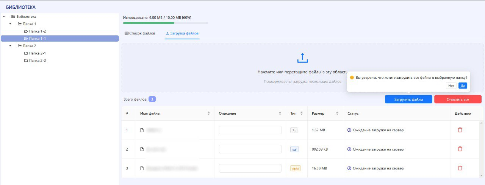

# Файловое хранилище
Реализован функционал облачного хранилища

## Функционал:
- Добавление/удаление файлов на сервер/с сервера
- Возможность добавления описания к файлу
- Drag and Drop
- Возможность скачивания и просмотра файлов в браузере
- Ограничение на количество занимаего файлами места в папке
- Таблицы с пагинацией
- Поиск по таблице файлов

## Требуется доработать:
- Разграничение прав
- Адаптивный вариант
- При большом количестве файлов понадобится серверная пагинация

## Стек:
- Flex
- Grid
- CSS modules
- Styled Components
- Ant Design
- React
- TypeScript
- Redux Toolkit (RTK Query)
- NodeJs (Express)
- Postgres

#Подготовка к загрузке файлов

#Результат загрузки

#Общий вид
